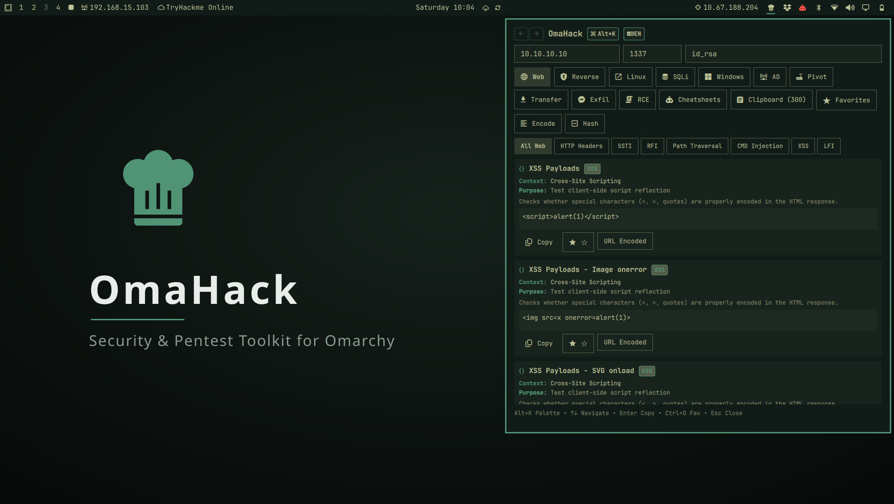
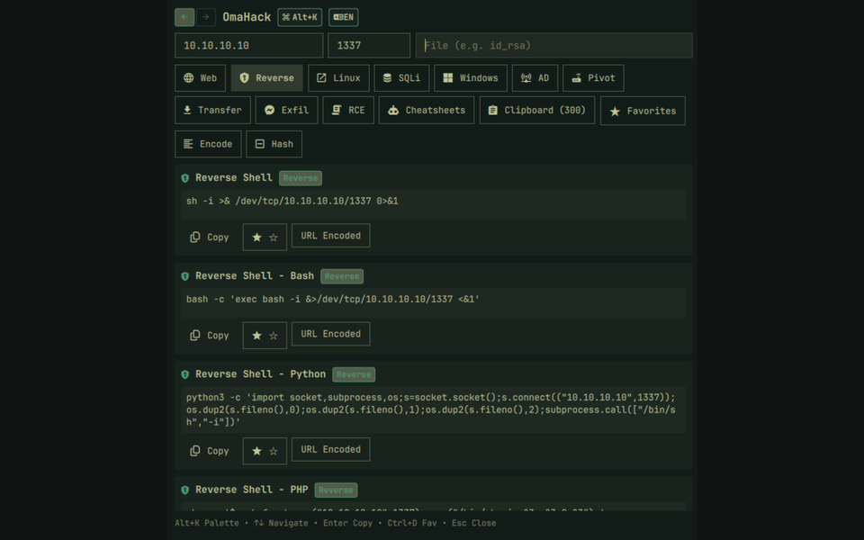
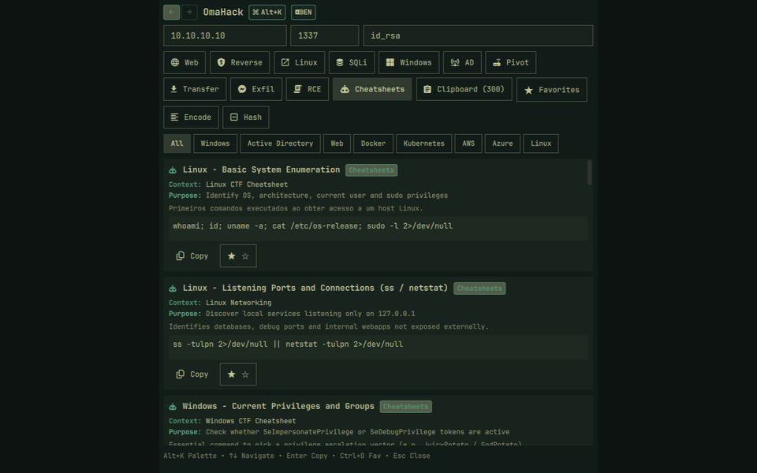
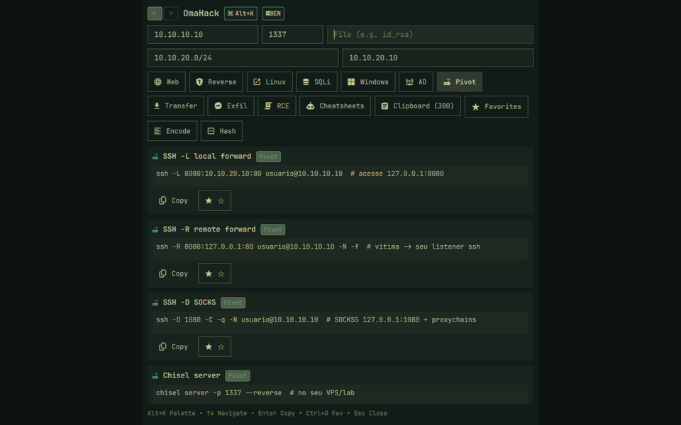
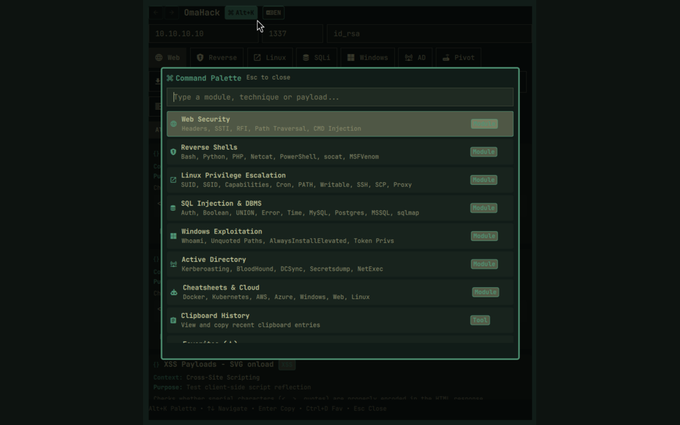

<h1 align="center">OmaHack</h1>



<h2 align="center">What it does</h2>

OmaHack lives in the Omarchy top bar and puts an offensive-security toolkit one click away: parameterized reverse shells, listeners, MSFVenom builders and webshells, plus exfiltration, RCE, SQLi, Active Directory and pivoting modules, CTF cheatsheets and encoding tools — everything with one-click copy (plain or URL-encoded), a bilingual interface and a searchable `Alt+K` command palette.

<h2 align="center">Screenshots</h2>

<table>
  <tr>
    <td align="center"><b>Reverse Shell</b><br></td>
    <td align="center"><b>Cheatsheets</b><br></td>
  </tr>
  <tr>
    <td align="center"><b>Pivoting</b><br></td>
    <td align="center"><b>Command palette</b><br></td>
  </tr>
</table>

<h2 align="center">Features</h2>

- Reverse shells: bash, sh, Python, PHP, Perl, Ruby, Node.js, PowerShell, Netcat, Ncat SSL, Socat, OpenSSL, Awk, Telnet, BusyBox
- Listeners: nc, ncat, ncat SSL, socat, socat full-TTY, Metasploit handler
- MSFVenom one-liners: ELF, PHP, ASPX, PS1, WAR
- Webshells: PHP, ASPX, JSP
- Data exfiltration: curl, wget, netcat, tar, base64 chunks, Python requests, DNS (`dig`/`nslookup`), ICMP, PowerShell, certutil, cloud metadata
- RCE / command injection: separators, `${IFS}` space bypass, base64 wrappers, PHP wrappers, SSTI (Jinja2), Log4Shell, upload bypass (`.htaccess`, `.user.ini`, extensions)
- SQLi: auth bypass, UNION enumeration, error-based, boolean blind, time-based (MySQL, PostgreSQL, MSSQL, SQLite), NoSQLi, `sqlmap` helpers
- Active Directory: enum4linux-ng, NetExec, ldapsearch, BloodHound/SharpHound, kerbrute, AS-REP roast, Kerberoast, hashcat modes, getTGT, golden ticket, ntlmrelayx, PetitPotam, Coercer, mitm6, Responder, evil-winrm, psexec/wmiexec, secretsdump, DCSync, mimikatz, GPP, Certipy
- Network pivoting: SSH `-L`/`-R`/`-D`/`-J`, sshuttle, Chisel, Ligolo-ng, socat relay, proxychains, Plink, `netsh portproxy`, Meterpreter autoroute/portfwd
- Cheatsheets: Linux, SQLi, Web, Windows, Active Directory, Docker, Kubernetes, AWS, Azure
- Tools: base64/URL/hex/HTML encoders, MD5/SHA1/SHA256/SHA512/SM3 hashing, clipboard history, favorites, command palette
- Multilingual interface: English (USA) and Portuguese (Brazil), including payload titles and descriptions

<h2 align="center">Requirements</h2>

- Omarchy Linux with the Quickshell bar
- `wl-copy` (clipboard copy)
- Optional per module: `nxc`/`crackmapexec`, `bloodhound-python`, `kerbrute`, `impacket`, `evil-winrm`, `sqlmap`, `chisel`, `sshuttle`, `hashcat`

<h2 align="center">Install</h2>

Via Omarchy plugin manager:

```bash
omarchy plugin add https://github.com/eudionelima/omahack --enable
```

Manual:

```bash
git clone https://github.com/eudionelima/omahack ~/.config/omarchy/plugins/dione.omahack
omarchy plugin enable dione.omahack
```

<h2 align="center">Uninstall</h2>

Via Omarchy plugin manager:

```bash
omarchy plugin remove dione.omahack
```

For manual installations, remove the plugin directory:

```bash
rm -rf ~/.config/omarchy/plugins/dione.omahack
```

<h2 align="center">Usage</h2>

1. Click the OmaHack icon in the bar.
2. Set LHOST / LPORT (plus Domain / User / DC for AD, Subnet / Target for pivoting).
3. Pick a module or press `Alt+K` for the command palette.
4. Click Copy (or the URL-encoded variant) and paste at the target.

The `EN`/`PT` button switches the interface between English and Brazilian Portuguese, including payload titles and descriptions.

<div align="center">

| Keys | Action |
| ---- | ------ |
| `Alt+K` | Command palette |
| `↑` `↓` | Navigate |
| `Enter` | Copy |
| `Ctrl+D` | Favorite |
| `Esc` | Close |

</div>

Favorites persist across restarts. Clipboard history keeps the last copied payloads.

<h2 align="center">Note</h2>

For authorized security testing, CTFs and lab environments only. Only use against systems you own or have explicit permission to test.

<h2 align="center">License</h2>

MIT — see [LICENSE](LICENSE).
